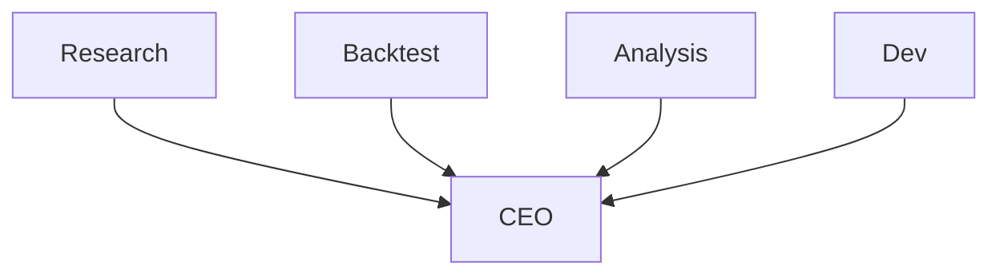

# Company: Org Design

Derive the agent topology from the roadmap. Based on the defined task types and workflow stages, propose which agent roles are needed, how they report to each other, and what each agent hands off.

This step produces a topology proposal for the user to review and approve before any individual agent is configured.

## User Input

```text
$ARGUMENTS
```

Optional: `--rebuild` to re-derive the topology from scratch (resets existing agent files).

## Prerequisites

1. `.specify/org/vision.md` exists.
2. `.specify/org/roadmap.md` exists.

## Steps

### Step 1: Load context

Read:
- `.specify/org/vision.md` — business purpose, success criteria
- `.specify/org/roadmap.md` — task types, stages, data flows
- `.specify/org/agents/` — list existing roles (for edit mode — highlight changes)

### Step 2: Derive topology

Analyze the roadmap and propose an agent organization:

1. **Identify stages** across all task types.
2. **Group stages** by domain expertise or capability: stages that require the same knowledge or tools are good candidates for one role.
3. **Define the CEO** — the mandatory root orchestrator: receives external tasks, dispatches to workers, aggregates results, escalates to the user when needed.
4. **Assign reporting lines** — workers report to whoever dispatches them (usually CEO, sometimes an intermediary).
5. **Define interfaces** — for each role: what does it receive as input and what does it hand off?

Present the proposed topology as a table:

```
PROPOSED TOPOLOGY

  ceo         Orchestrator       receives external tasks, dispatches and aggregates
    ↳ research  Research Agent   takes strategy idea → produces research report
    ↳ backtest  Backtest Agent   takes research report → produces backtest metrics
    ↳ analyse   Analysis Agent   takes metrics → produces risk/quality assessment
    ↳ dev       Dev Agent        implements indicators/fixes on request from CEO
```

For each role also show:
- `reports_to`
- Key capabilities (e.g. `shell:execute`, `network:fetch`, `filesystem:write`)
- Likely `nix_packages` (infer from domain — e.g. `python311` for a data-heavy role, `git` for anything that touches repos)
- Primary input and output (one line each)

### Step 3: User review

Present the proposal. Allow the user to:
- Accept as-is
- Add a role (describe it and the AI drafts its row)
- Remove a role
- Change `reports_to` for any role
- Rename a role

### Step 4: Chain to hire

After approval, offer to hire each agent in order (CEO first):

> "Topology approved — 5 roles. Shall I start configuring them? I'll begin with `ceo`."

If yes → run `/speckit-company.hire <role>` for each role in topological order (CEO first, then workers in BFS order of the reports-to tree).

### Step 5: Render org chart

After all hires complete, write `.specify/org/org-chart.md` with a Mermaid `graph TD` diagram derived from the agents' `reports_to` fields:



## Notes

- Org Design is not a one-time step. Re-run it when the roadmap changes significantly — it will diff the proposed topology against existing agents.
- The proposal is a starting point, not a prescription. The user has the final say.
- Roles that span too many domains (more than 2–3 distinct capability classes) are a design smell — consider splitting them.
- A role with no clear input/output interface to another role is also a smell — consider whether it belongs in this company.
